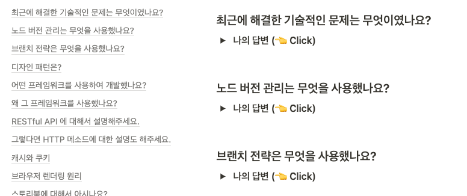

<div align="center">
  
</div>
<h1 align="center">🙋 Front-End Tech Interview</h1>

<br />

```
누구한테 가르쳐준다고 생각하면서 연습합니다.

간단한 질문이라도 인터넷에서 떠도는 지식을 외우는 수준이 아니라, 상당히 깊이있게 준비합니다.
이해가 안된다면 직접 코드를 작성해서 동작을 확인해봅니다.
어떤 질문이 나올지 모르지만 적어도 준비한 질문은 옆구리를 쿡 찌르면 줄줄 나올 수 있을 정도로 공부합니다.
```

<br />

<details>
  <summary>
    <strong>👩🏻‍💻 노션에 정리하고 제대로 이해한 내용만 여기에 올려두는 중입니다 (👈 Click!)</strong>
  </summary>
  
</details>

<br />

### [1. FE](https://github.com/mireyhgnay/tech-interview/blob/main/FE/FE.md)

### [2. CSS](https://github.com/mireyhgnay/tech-interview/blob/main/CSS/CSS.md)
